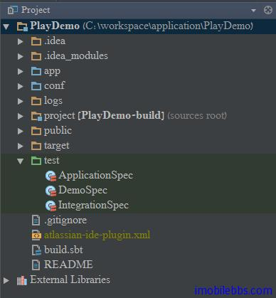
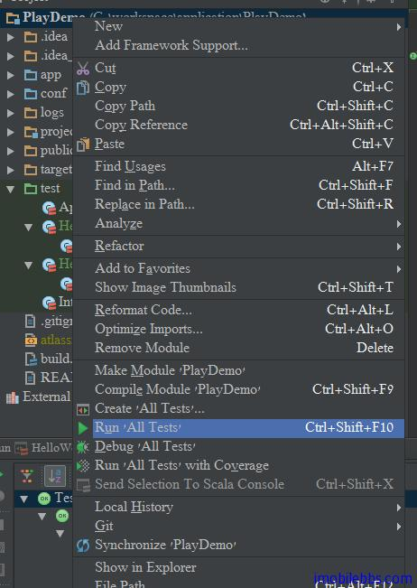
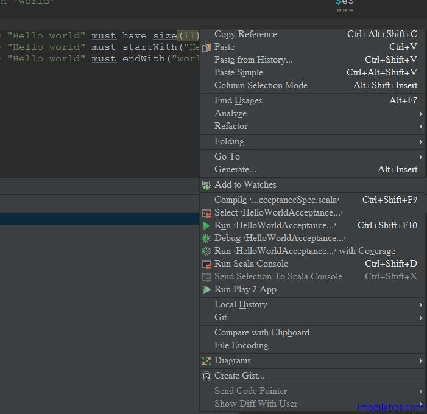

# Scala Specs2 测试入门教程（1）：简介

测试也是开发过程中非常重要一环，本博客介绍 Scala 开发的主要目的是为了日后的 Play 应用开发做基础，开发环境采用 IntelliJ IDEA 集成开发环境。因此使用 IntelliJ 创建 Play 应用时缺省使用的测试包（基于 Spec2)



Play 应用缺省在 test 目录下创建了两个测试类： 为 ApplicationSpec 和 IntegrationSpec ，我们暂时不去管它们。以后在介绍 Play 开发时再说。

本系列博客介绍 Spec2 测试（其它测试使用的模板还可以是 scalatest, JUnit,TestNG），其测试的为通用的类（和 Play 特定的测试无关）。

Specs2 的测试规范分为两大类型：

- 单元测试规范： 这种测试规范和测试代码混合在一起，它通常用来测试单个类。
- 验收测试规范： 这种测试规范的为一个整体，与其测试代码分开，它通常用于熟悉集成或验收测试规范。

Specs2 测试为一种行为驱动测试方法，它的着重点在于使用可由人员的文字描述代码期望的一些行为，配合测试代码来验证所需要测试的代码符合期望的规范。

下面我们使用例子来说明一下两种风格的测试规范：

## 单元测试

单元测试规范派生于 org.specs2.mutable.Specification ，使用 should/in 的格式。

```
import org.specs2.mutable._

class HelloWorldUnitSpec extends Specification {

  "HelloWorldUnit" should {
    "contain 11 characters" in {
      "Hello world" must have size(11)
    }
    "start with 'Hello'" in {
      "Hello world" must startWith("Hello")
    }
    "end with 'world'" in {
      "Hello world" must endWith("world")
    }
  }
}
```

## 验收测试规范

验收测试规范继承自 org.specs2.Specification ，并且定义 is 方法。

```
import org.specs2._

class HelloWorldAcceptanceSpec extends Specification { def is = s2"""

 This is a specification to check the 'Hello world' string

 The 'Hello world' string should
   contain 11 characters                                         $e1
   start with 'Hello'                                            $e2
   end with 'world'                                              $e3
                                                                 """

  def e1 = "Hello world" must have size(11)
  def e2 = "Hello world" must startWith("Hello")
  def e3 = "Hello world" must endWith("world")
}
```

## 运行测试

运行测试的方法有很多种，在 Play 环境下，可以使用 play test 来运行，在 IntelliJ IDEA 可以通过菜单

 	

如果需要运行或调试单个测试用例，可以在测试用例点击右键，选择

