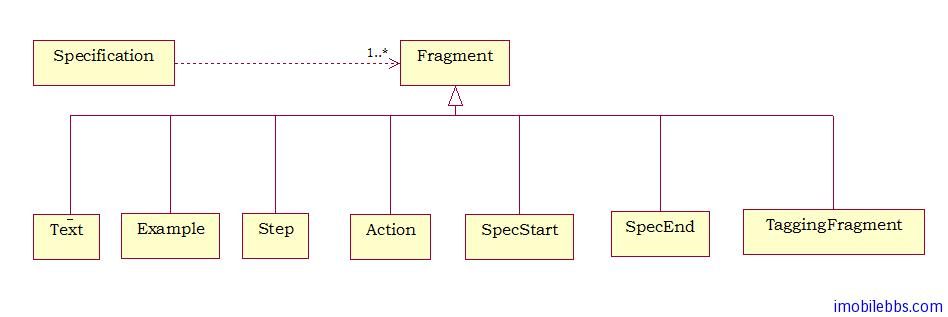

# Scala Specs2 测试入门教程（2）：Specs2 的设计思想

在详细介绍 Specs2 用法之前，我们先了解一下 Specs2 的设计思想：

## 结构

Specs2 的测试规范 Specification 的结构非常简单，它有多个 Fragment 构成，这个 Fragment 的列表由 SpecificationStructure Trait 的 is 方法来指明：



其中：

- Text： 描述系统的任意文字。
- Example: 有文字和可返回此时结果的测试代码构成。
- Step/Action: 单系统抛出异常时才执行的动作。
- SpecStart/SpecEnd: 测试规范的分界符。 它也可用来分开包含的子规范。
- TaggingFragment: 可以包含其它 Framgent 的 Fragment 对象，这些 Fragment 集合可以包含或排除在需要运行的测试用例中。
 
## 创建 Fragment

Specs2　定义了一下隐含的转换用来创建　Fragment　对象（定义在　org.specs2.specification.FragmentsBuilder Trait　中).比如：

String => Text 由字符串创建 Text 对象    　　　　
String ! Result => Example 创建一个 Example 对象  　　　　
等等　　　　  

一旦构造好这些对象，可以通过“^” 操作符来链接这些测试对象。 从而创建一个 Fragments 对象，它包含了一个 Seq[Fragment] 对象。

```
val fragments: Fragments =
    "this text" ^
    "is related to this Example" ! success
```
	
这个 Fragments 对象用来临时存放一个 Fragment 对象列表，用来保证这些 Fragment 对象执行时开始和结束于正确的 SpecStart 和 SpecEnd 位置。

## 可变的 Specification

在一个可变的 Specification 中，多个 Fragments 之间没有”可见“的链接，它们是通过所谓的“副作用（side effect)”关联（借助于 org.specs2.mutable 的增强版 FragmentsBuilder）。

```
// build an Example and add it to the specFragments variable
  "this example must succeed" in { success }
  "same thing here" in { success }
```

## 执行

测试的执行是由不同的 reports 对象来触发。分为下面五步：

1. Selection：使用参数来过滤需要执行的 Fragment 对象。在这一步，几乎所有的 Example（少数除外）可以使用 only(“this example”) 来过滤掉，另外一种选择 Fragment 对象的方法是通过插入在 Specification 中插入 TaggingFragments 来实现。 如果 isolated 参数为 true 时，每个 Example 对象的执行体通过复制同一个 Specification 来避免局部变量可能带来的副作用。
2. Sequencing：通过将 Fragments 分组排序来支持同一组中的 Fragment 可以同步运行。这也说明了 step 的由来。 假定一个 fragments 对象是：fragments1 ^ step ^ fragments2 ，那么所有的 fragments1 都会执行，然后执行 step，最后执行 fragments2。
3. Execution：对于每个分组，缺省其中的 Fragment 对象的执行是同时的，执行的结果存放在一组 ExecutingFragments 中。 并且无需等所有 Fragments 都运行完成就可以给出报告。
4. Storing：测试完成后，我们需要计算测试的统计结果，并把结果存放在一个文件中 specs2-reports/specs2.stats。
5. Exporting：取决于 Exporter,ExecutedFragments 可以把报告输出到屏幕或是一个 HTML 文件中。

## 测试报告

所有的测试报告由一组 ExecutingFragment 对象构成，一个 Reducer 对象列表用来采集相关信息。

- 显示文字和结果
- 显示文字的等级（也就是缩进）
- 统计和执行时间
- 适用的参数等